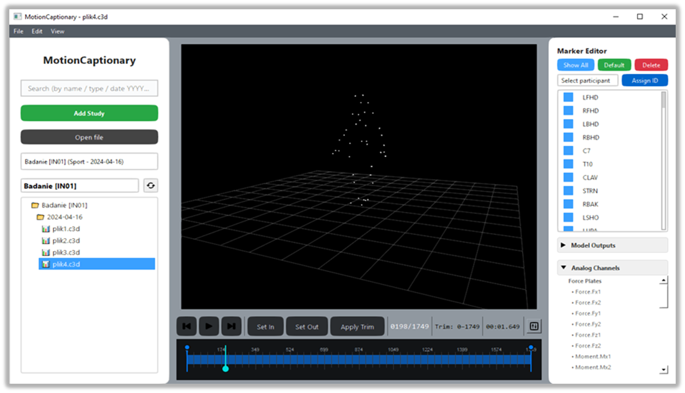
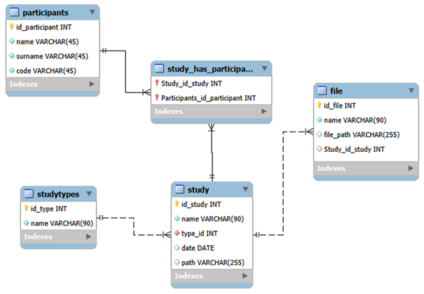

# MoCap App - aplikacja desktopowa do ewidencji i zarządzania danymi akwizycji ruchu
### Praca dyplomowa z wyróżnieniem

## ✨ Funkcjonalności

-  **Wizualizacja 3D** — podgląd markerów w czasie rzeczywistym (PyQtGraph + OpenGL)
-  **Edytor markerów** — zmiana nazw, usuwanie, anonimizacja, kontrola widoczności
-  **Przycinanie nagrań** — przycinanie plików C3D z obsługą undo/redo
-  **Zarządzanie badaniami** — organizacja badań, uczestników i plików (MySQL)
-  **Przeglądarka plików** — nawigacja drzewem z wyszukiwaniem i importem
-  **Ustawienia** — konfiguracja FPS, dystansu kamery, parametrów siatki

## 📸 Podgląd



## 🛠️ Stos technologiczny

| Warstwa | Technologia |
|---------|-------------|
| Interfejs | PySide6 (Qt6) |
| Grafika 3D | PyQtGraph + OpenGL |
| Odczyt C3D | ezc3d / python-c3d |
| Baza danych | MySQL |
| Język | Python 3 |

## 📸 Baza danych

<p align="center">
  
</p>

## 📂 Struktura projektu

```
MoCap_App/
├── assets/icons/                    # Ikony 
├── data/user_settings.json          # Ustawienia użytkownika 
├── src/
│   ├── __init__.py
│   ├── main.py                      # Punkt wejścia aplikacji
│   ├── config.py                    # Konfiguracja
│   ├── data_processing/
│   │   ├── config_manager.py        # Zarządzanie ustawieniami użytkownika
│   │   ├── marker_editor.py         # Widget edytora markerów 
│   │   └── recording_trimmer.py     # Logika przycinania nagrań
│   ├── database/
│   │   ├── database_schema.sql      # Schemat bazy danych MySQL
│   │   ├── db_manager.py            # Operacje CRUD 
│   │   ├── init_db.py               # Inicjalizacja bazy danych
│   │   └── models.py                # Modele danych 
│   ├── ui/
│   │   ├── main_window.py           # Główne okno
│   │   ├── message_box.py           # Stylowane okna dialogowe
│   │   └── widgets/
│   │       ├── add_participant_dialog.py  # Dialog dodawania/edycji uczestnika 
│   │       ├── add_study_dialog.py        # Dialog tworzenia badania 
│   │       ├── add_type_dialog.py         # Dialog dodawania/edycji typu badania
│   │       ├── edit_study_dialog.py       # Dialog edycji istniejącego badania 
│   │       ├── file_tree_widget.py        # Drzewo plików — przeglądanie folderu badania, import/usuwanie C3D, show in explorer
│   │       ├── rename_marker_dialog.py    # Dialog zmiany nazwy markera
│   │       ├── search_file_dialog.py      # Dialog wyszukiwania plików C3D w bazie danych 
│   │       └── settings_dialog.py         # Dialog ustawień wizualizacji (frame rate, kamera, siatka)
│   └── visualization/
│       └── viewer3d.py            
```


